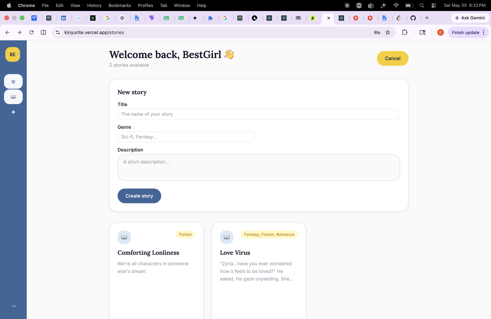

# Kinyurite

A collaborative storytelling platform where lead authors create stories and chapters, and contributors propose alternate branches for review, feedback, and merging.

## Tech Stack

**Backend:** Python · FastAPI · SQLAlchemy · PostgreSQL · JWT auth · Pydantic
**Frontend:** React 19 · React Router v7 · Vite · Tailwind CSS · Axios
**Testing:** pytest

## Key Features

- Role-based access for `lead_author` and `contributor`
- Lead authors create stories, chapters, and review branch proposals
- Contributors draft branch proposals, submit for review, and receive feedback
- Branch lifecycle: `DRAFT → SUBMITTED → UNDER_REVIEW → MERGED / REJECTED`
- Responsive dashboard UI with story cards, review panel, contributor branch list, and sidebar navigation
- JWT authentication with protected frontend routes

## Project Structure

```
kinyurite/
├── app/
│   ├── main.py          # FastAPI app entry point
│   ├── auth.py          # JWT auth, password hashing, and current user retrieval
│   ├── database.py      # SQLAlchemy engine, session factory, and model registration
│   ├── models/          # ORM models (user, story, chapter, branch)
│   ├── routers/         # API routers for auth, users, stories, chapters, branches, review
│   └── schemas/         # Pydantic request/response schemas
├── frontend/
│   ├── src/
│   │   ├── api/         # Axios client with auth header handling
│   │   ├── components/  # Sidebar, Navbar, DiffViewer, UI primitives
│   │   └── pages/       # Login, Register, Stories, StoryDetail, BranchEditor, ReviewDashboard, ContributorDashboard, ChapterEditor
│   ├── package.json
│   └── tailwind.config.js
├── tests/               # backend unit tests for auth, branches, and state machine
├── requirements.txt
└── .env
```

## Setup

## Live Demo: https://kinyurite.vercel.app/

### Prerequisites

- Python 3.11+
- Node.js 18+
- PostgreSQL

### Environment Variables

Create a `.env` file in the project root:

```env
DATABASE_URL=postgresql://<user>:<password>@localhost:5432/kinyurite
SECRET_KEY=<your-secret-key>
```

### Backend Setup

```bash
python -m venv venv
source venv/bin/activate
pip install -r requirements.txt
uvicorn app.main:app --reload
```

API runs at `http://localhost:8000`. Interactive docs are available at `http://localhost:8000/docs`.

### Frontend Setup

```bash
cd frontend
npm install
npm run dev
```

Frontend runs at `http://localhost:5173`.

### Build Frontend for Production

```bash
cd frontend
npm run build
```

## Running Tests

From the project root:

```bash
source venv/bin/activate
python -m pytest -q
```

### Test files

- `tests/test_auth.py`
- `tests/test_branches.py`
- `tests/test_state_machine.py`

## Frontend Routes

| Path | Page |
|------|------|
| `/login` | Login |
| `/register` | Register |
| `/stories` | Story dashboard |
| `/stories/:storyId` | Story detail page |
| `/chapters/:chapterId/branch` | Branch editor for contributors |
| `/stories/:storyId/chapters/:chapterId/edit` | Chapter editor for lead authors |
| `/review` | Review dashboard for lead authors |
| `/my-branches` | Contributor branch dashboard |

## API Reference

### Auth

| Method | Endpoint | Description |
|--------|----------|-------------|
| POST | `/auth/register` | Register a new user with role `lead_author` or `contributor` |
| POST | `/auth/login` | Authenticate and receive a JWT token |
| GET | `/auth/me` | Get current authenticated user profile |

### Stories

| Method | Endpoint | Description |
|--------|----------|-------------|
| GET | `/stories/` | List all stories |
| POST | `/stories/` | Create a story *(lead_author only)* |
| GET | `/stories/{story_id}` | Get a single story |
| DELETE | `/stories/{story_id}` | Delete a story *(lead_author only)* |

### Chapters

| Method | Endpoint | Description |
|--------|----------|-------------|
| GET | `/stories/{story_id}/chapters/` | List chapters for a story |
| POST | `/stories/{story_id}/chapters/` | Create a chapter *(lead_author only)* |
| GET | `/stories/{story_id}/chapters/{chapter_id}` | Get chapter details |
| PATCH | `/stories/{story_id}/chapters/{chapter_id}` | Update a chapter *(lead_author only)* |

### Branches

| Method | Endpoint | Description |
|--------|----------|-------------|
| POST | `/chapters/{chapter_id}/branches/` | Create a branch draft *(contributor only)* |
| GET | `/chapters/{chapter_id}/branches/` | List branches for a chapter *(lead_author only)* |
| PATCH | `/chapters/{chapter_id}/branches/{branch_id}/status` | Update branch status and feedback |

### Review

| Method | Endpoint | Description |
|--------|----------|-------------|
| GET | `/review/pending` | Get pending branches for lead author review |
| GET | `/review/my-branches` | Get current contributor branches |

## Dependencies

### Backend

- `fastapi`
- `uvicorn`
- `sqlalchemy`
- `pydantic`
- `python-jose`
- `bcrypt`
- `python-dotenv`
- `psycopg2-binary`

### Frontend

- `react` 19
- `react-router-dom` 7
- `axios`
- `tailwindcss`
- `@fontsource-variable/geist`
- `shadcn`
- `diff-match-patch`

For the full dependency list, see `requirements.txt` and `frontend/package.json`.

### Screenshots

**Lead Author View**




**Contributer View**

